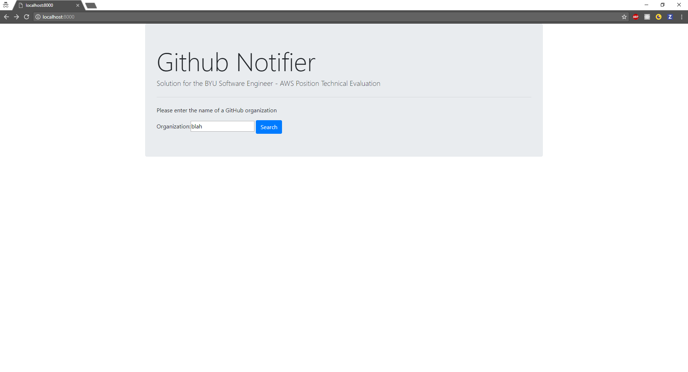
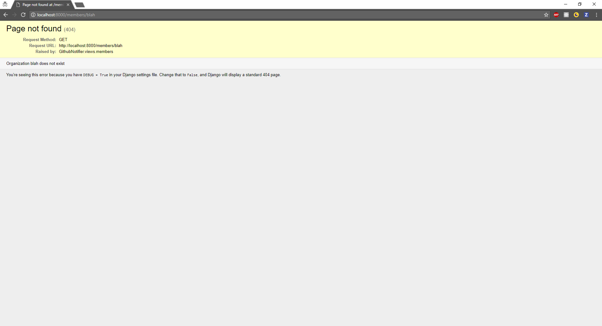
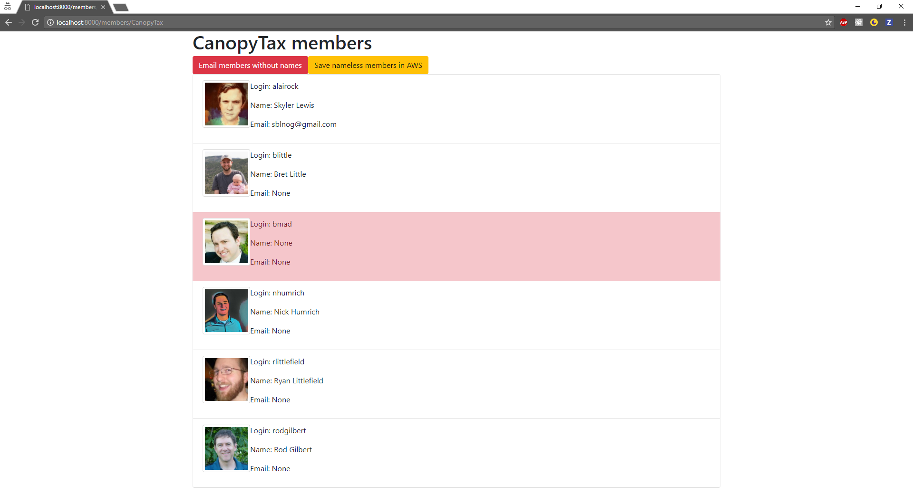

# Github Notifier

BYU Software Engineer - AWS Position Technical Evaluation by Cameron Jones

* * * 

### Why Django?

1. Demonstrate Python proficiency
2. Displaying users in an organization allows for easier validation of results
3. Real-world practicality: apps typically do not run in a command line environment
4. Application only needs to be run once

### Setup
* [Generate IAM user and tokens](https://console.aws.amazon.com/iam)

    * Give the user programmatic access
    * Attach the existing `AmazonS3FullAccess` policy to the user
    * Once the user is created, save the Access Key ID and Secret Access Key values in a safe location

* [Create the S3 bucket](https://console.aws.amazon.com/s3) with default parameters

* Generate auth token for project

    Go to [https://github.com/settings/tokens](https://github.com/settings/tokens) to generate a new auth token. Be sure that it has access to the `read:org`, `read:user`, and `user:email` scopes 
    
    Be sure to remember to copy the token and save it. You won't be able to see it again once you navigate away from the page.

* Create virtualenv for project

        virtualenv -p <location of python3 interpreter> ENV
    
    where `ENV` is the directory to place the new virtual environment. You should be able to get away with `python3` for Linux, but you may have to specify the full path to the python 3 executable for Windows.

* Set environment variables for the `GITHUB_NOTIFIER_AUTH_TOKEN`, `AWS_ACCESS_KEY_ID`, `AWS_SECRET_ACCESS_KEY`, and `AWS_BUCKET_NAME` environment variable (`your auth token` is the token you generated in the first step)

    * Linux / Mac OS X:
        
        In `ENV/bin/activate`, add the following lines at the end of the file
    
            export GITHUB_NOTIFIER_AUTH_TOKEN=<your auth token>
            export AWS_ACCESS_KEY_ID=<your AWS access key id>
            export AWS_SECRET_ACCESS_KEY=<your AWS secret access key>
            export AWS_BUCKET_NAME=<your AWS S3 bucket name>
            
        In the `deactivate` function in `ENV/bin/activate`, add the following lines at the start
        
            unset GITHUB_NOTIFIER_AUTH_TOKEN
            unset AWS_ACCESS_KEY_ID
            unset AWS_SECRET_ACCESS_KEY
            unset AWS_BUCKET_NAME
    
    * Windows
    
        In `ENV/Scripts/activate.bat`, add the following lines at the end of the file

            set "GITHUB_NOTIFIER_CLIENT_AUTH_TOKEN=<your auth token>"
            set "AWS_ACCESS_KEY_ID=<your AWS access key id>"
            set "AWS_SECRET_ACCESS_KEY=<your AWS secret access key>"
            set "AWS_BUCKET_NAME=<your AWS S3 bucket name>"
        
        In `ENV/Scripts/deactivate.bat`, add the following lines at the beginning of the file
        
            set GITHUB_NOTIFIER_CLIENT_AUTH_TOKEN=
            set AWS_ACCESS_KEY_ID=
            set AWS_SECRET_ACCESS_KEY=
            set AWS_BUCKET_NAME=

* Activate the virtualenv from its root directory

        source bin/activate
    for Linux
    
        \path\to\env\Scripts\activate
    for Windows
    
* Install `django` and `boto3` packages

        pip install django
        pip install boto3

    
    
### Run the project

Navigate to the root of the project (with the same terminal that you activated the virtualenv in) and run

    python manage.py runserver

Navigate to `localhost:8000` to view the app

### How it works

`localhost:8000` will take you to the homepage of the notifier

You can enter the name of an organization in the search bar. If no such organization exists, you will be notified that the organization doesn't exist

If the organization exists, you will be redirected to a list of the members of the organization with the following details:

* Avatar
* Login
* Name
* Email

Members without names will be highlighted in red

The member list page also includes two buttons at the top of the list

* "Email members without names"

    Sends an email to each member who doesn't have their name listed. Email logs will be saved in the tmp/email-messages directory instead of being sent directly to the email address.

* "Save nameless members in AWS"

    Saves the information of each nameless member in an AWS bucket. The file will be in the format `{organization}-{timestamp}.txt`, where `organization` is the name of the organization, and `timestamp` is the timestamp of the file creation date

### Other notes

This is the first application that I wrote with Django. As such, there may be best practices that I am unaware of. Possible ways to clean this up in the future include:

* Standardizing quotes. There are files where I use single quotes and others where I use double quotes
* My `GithubNotifier/views.py` file seems to be doing everything. Perhaps there is a way to split up the file to make it cleaner and easier to debug
* I don't know how to write proper unit tests for Django, especially given the functionality. The testing that I did was primarilly manual testing (Comparing results with Github organization list, marking nameless members in red, comparing # emails received to the number of nameless members, etc...)
* This doesn't handle very large organizations such as Microsoft very well (3600 public users alone). This is due to the fact that I would need to make over 100 calls to the `org/{org}/members` endpoint to get every member, and for each memeber, I would need to make a call to the `/user/{username}` endpoint to get name and email information. I don't know if it is possible to speed this process up any further given the limitations.